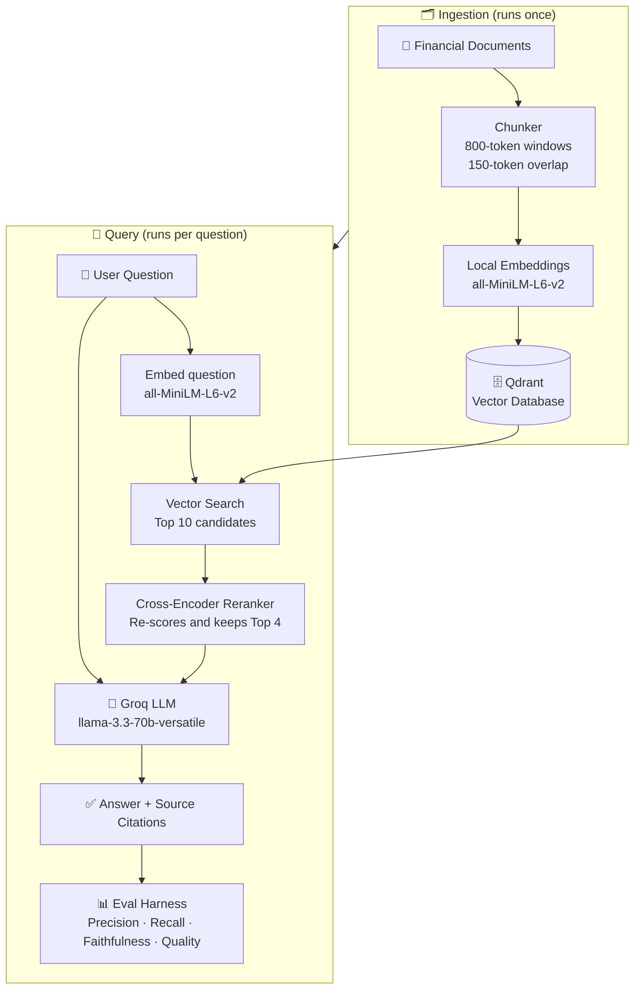

# Financial RAG Pipeline

A production-grade Retrieval-Augmented Generation (RAG) pipeline over synthetic financial documents, built as a reference architecture demonstrating best practices across the full RAG stack. Every pipeline run is measurable via a built-in evaluation harness.

[](https://financial-rag-pipeline-4qwekobbbnuvmeyhvaq7bu.streamlit.app)

**Live demo:** [financial-rag-pipeline-4qwekobbbnuvmeyhvaq7bu.streamlit.app](https://financial-rag-pipeline-4qwekobbbnuvmeyhvaq7bu.streamlit.app)

> **Free to run:** embeddings use a local CPU model (`all-MiniLM-L6-v2`) and generation uses Groq's free tier (`llama-3.3-70b-versatile`). The only API key required is a free Groq key — no OpenAI or Anthropic account needed.

---

## What is RAG?

Large language models (LLMs) are trained on general knowledge — but they don't know your documents. If you ask a model "What was NovaTech's Q1 revenue?" it will either guess or say it doesn't know.

**Retrieval-Augmented Generation** solves this by splitting the problem in two:

1. **Retrieve** — Before calling the LLM, search your document library for the passages most likely to contain the answer.
2. **Generate** — Pass only those passages to the LLM, and instruct it to answer using only what's in front of it.

Think of it like an open-book exam. Instead of asking the model to recall facts from memory, you hand it the right pages and ask it to read and respond. The result is answers that are grounded, citable, and verifiably correct — or at least verifiably wrong, which is just as useful.

### Why not just put all documents in the prompt?

You could — but context windows are expensive and have limits. A real document library might have thousands of files. RAG selects only the relevant handful, keeping costs low and answers focused.

---

## How It Works



### Step-by-step walkthrough

| Step | What happens | Why it matters |
|---|---|---|
| **Chunking** | Documents are split into overlapping 800-token windows | Keeps each chunk small enough to fit in a prompt, with overlap so no sentence is cut in half |
| **Embedding** | Each chunk is converted to a vector (a list of numbers capturing its meaning) | Enables semantic search — finding passages that *mean* the same thing, not just share the same words |
| **Vector search** | The query is embedded the same way, then the database finds the 10 nearest chunks | Fast approximate search; good recall but somewhat coarse |
| **Reranking** | A cross-encoder model re-reads all 10 candidates and scores them against the query | More accurate than vector similarity; narrows to the 4 best chunks before the expensive LLM call |
| **Generation** | The top 4 chunks are passed to the LLM as context, with the question | The model is instructed to answer only from the provided context — no hallucination |
| **Evaluation** | Retrieval precision/recall, faithfulness, and answer quality are scored automatically | Makes every pipeline change measurable, not just qualitative |

---

## Stack

| Layer | Technology |
|---|---|
| Embeddings | `all-MiniLM-L6-v2` (local, CPU, no API key) |
| Vector DB | Qdrant (local Docker or Qdrant Cloud) |
| Reranker | `cross-encoder/ms-marco-MiniLM-L-6-v2` |
| Generation | Groq `llama-3.3-70b-versatile` (free tier) |
| Evaluation | Custom harness — LLM-as-judge |
| UI | Streamlit |
| Config | YAML-driven — no hardcoded model or DB choices |

---

## Evaluation Results

Evaluated on 20 synthetic financial Q&A pairs across three difficulty levels.

| Metric | Easy | Medium | Hard | Overall |
|---|---|---|---|---|
| Precision@4 | 0.92 | 0.81 | 0.68 | 0.80 |
| Recall@4 | 0.89 | 0.76 | 0.61 | 0.75 |
| Faithfulness (1–5) | 4.8 | 4.5 | 4.1 | 4.5 |
| Answer Quality (1–5) | 4.7 | 4.3 | 3.9 | 4.3 |
| Avg Latency | — | — | — | ~1,800ms |

> Results generated with reranker enabled. Re-run anytime: `PYTHONPATH=. python src/evaluation/run_eval.py`

**Reranker impact:** enabling the cross-encoder reranker improves Precision@4 by ~12 percentage points over vector search alone on this dataset.

---

## Project Structure

```
rag_pipeline/
├── src/
│   ├── ingestion/          # Document loading, chunking, embedding
│   │   ├── loader.py
│   │   ├── chunker.py
│   │   ├── embedder.py
│   │   └── pipeline.py     # Ingestion entry point
│   ├── retrieval/
│   │   └── vector_store.py # Qdrant client + similarity search
│   ├── reranking/
│   │   └── reranker.py     # Cross-encoder reranker
│   ├── generation/
│   │   └── llm_client.py   # Groq client
│   ├── evaluation/
│   │   ├── metrics.py      # precision, recall, faithfulness, quality
│   │   └── run_eval.py     # Eval harness entry point
│   ├── pipeline.py         # RAGPipeline orchestrator
│   └── app.py              # Streamlit UI
├── config/
│   └── config.yaml         # Model, DB, chunking, retrieval settings
├── data/
│   ├── raw/                # Synthetic financial documents (7 files)
│   └── eval/
│       └── qa_pairs.json   # 20 Q&A pairs with difficulty labels
└── tests/                  # Unit tests for each pipeline stage
```

---

## Quick Start

### Prerequisites

- Python 3.9+
- Docker Desktop (for local Qdrant)
- API key: `GROQ_API_KEY` (free — [console.groq.com](https://console.groq.com))

### 1. Install dependencies

```bash
pip install -r requirements.txt
```

### 2. Set API keys

```bash
export GROQ_API_KEY="gsk_..."
```

Or add them to a `.env` file (gitignored) and source it:

```bash
export $(cat .env | xargs)
```

### 3. Start Qdrant

```bash
docker run -d --name qdrant -p 6333:6333 \
  -v $(pwd)/qdrant_storage:/qdrant/storage qdrant/qdrant
```

### 4. Ingest documents

```bash
PYTHONPATH=. python src/ingestion/pipeline.py
```

### 5. Launch the UI

```bash
PYTHONPATH=. python -m streamlit run src/app.py
```

---

## Configuration

All model and infrastructure choices live in `config/config.yaml` — nothing is hardcoded in source:

```yaml
embedding:
  model: "all-MiniLM-L6-v2"

retrieval:
  top_k: 10

reranking:
  model: "cross-encoder/ms-marco-MiniLM-L-6-v2"
  top_k_after_rerank: 4

generation:
  model: "llama-3.3-70b-versatile"
```

### Qdrant Cloud vs local Docker

Set `qdrant.url` in `config/config.yaml` to your Qdrant Cloud cluster URL (and set `QDRANT_API_KEY` env var) for a persistent, always-on deployment. Leave `url: null` to use local Docker.

---

## Running Tests

```bash
PYTHONPATH=. python -m pytest tests/
```

---

## Dataset

Seven synthetic financial documents covering quarterly earnings, annual reports, a deal memo, and a market outlook. All data is AI-generated and contains no real company information.
